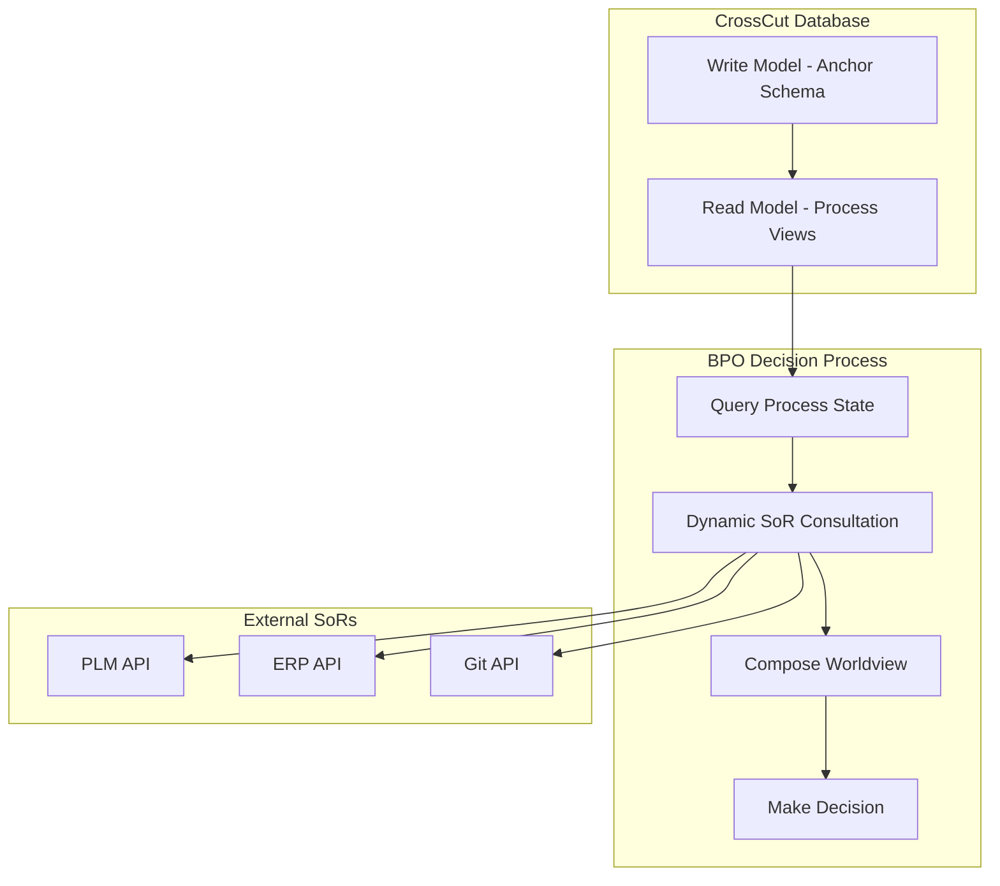

# RFD 3: Read Model Scope and Data Boundaries - Questioning the "World Model" Approach

**State:** `discussion`

## 1. Motivation

Following the architectural discussions in RFD 1 and RFD 2, this document addresses a fundamental question about the scope and necessity of CrossCut's read model. Specifically: **Should the CrossCut platform maintain a comprehensive "World Model" by synchronizing data from external Systems of Record (SoRs), or should it limit its read model to its own audit trail and dynamically query SoRs for context?**

The current specifications suggest a broad "World Model" approach where CrossCut maintains materialized views containing data from external SoRs. This RFD questions whether this approach aligns with the platform's core mission and proposes a more focused alternative.

## 2. Current Architecture Assumptions

### 2.1. The "World Model" Concept

The current specifications describe CrossCut's read model as a "World Model" that:

- Provides "context-rich" views of "the state of the enterprise"
- Includes data synchronized from external SoRs (PLM, ERP, etc.)
- Uses materialized views to pre-compute complex joins across multiple data sources
- Aims to give the BPO fast access to comprehensive enterprise state

### 2.2. Implied Data Synchronization

This approach implies:

- **ETL processes** to sync data from SoRs into CrossCut's database
- **Schema mapping** between diverse external systems and CrossCut's internal model
- **Data freshness management** across multiple external sources
- **Conflict resolution** when external systems disagree or are out of sync

## 3. The Core Question: What Data Does CrossCut Actually Own?

### 3.1. CrossCut's True Domain

CrossCut's core value proposition is **process orchestration**, not data aggregation. Its primary concerns are:

- **Workflow state**: What processes are running, paused, or completed?
- **Process history**: What orchestration decisions were made and when?
- **Coordination metadata**: Which SoRs were consulted, what commands were issued?
- **Audit trail**: An immutable log of all orchestration actions

### 3.2. What CrossCut Does NOT Own

CrossCut explicitly does **not** own:

- **Business entity data**: Parts, products, BOMs, test results, etc.
- **Domain logic**: Validation rules, business rules, approval workflows
- **Master data**: The authoritative state of engineering artifacts

These remain the exclusive domain of the respective SoRs.

## 4. Proposed Alternative: Audit-Centric Read Model

### 4.1. Core Principle

**CrossCut's read model should focus exclusively on its own audit trail and process state, not on external SoR data.**

### 4.2. Architectural Implications



### 4.3. Read Model Contents

The materialized views would contain only:

```sql
-- Example: Active Workflows View
CREATE MATERIALIZED VIEW active_workflows_view AS
SELECT
    wf.workflow_id,
    wf.workflow_type,
    wf.status,
    wf.created_at,
    wf.last_updated,
    step.current_step,
    step.step_status,
    meta.external_references -- SoR IDs, not SoR data
FROM workflow_anchor wf
LEFT JOIN workflow_step_attribute step ON ...
LEFT JOIN workflow_metadata_attribute meta ON ...
WHERE wf.status IN ('active', 'paused');

-- Example: Recent Orchestration Actions View
CREATE MATERIALIZED VIEW recent_actions_view AS
SELECT
    action.action_id,
    action.workflow_id,
    action.action_type,
    action.target_service,
    action.timestamp,
    action.result_status
FROM orchestration_action_anchor action
WHERE action.timestamp > NOW() - INTERVAL '24 hours';
```

### 4.4. Decision-Making Process

When the BPO needs to make a decision:

1. **Query internal state**: Read from materialized views to understand workflow status
2. **Identify required context**: Determine which external data is needed
3. **Dynamic SoR consultation**: Make API calls to relevant SoRs
4. **Compose session-based worldview**: Aggregate responses in memory or temporary cache
5. **Make orchestration decision**: Based on fresh, authoritative data
6. **Record decision**: Write to audit trail

## 5. Benefits of the Audit-Centric Approach

### 5.1. Simplified Data Boundaries

- **Clear ownership**: CrossCut owns process data, SoRs own business data
- **No ETL complexity**: No need to sync, map, or resolve external data
- **Reduced coupling**: Changes in SoR schemas don't break CrossCut
- **Authoritative data**: Always querying the source of truth

### 5.2. Better Scalability

- **Smaller database**: Only process metadata, not enterprise data
- **Faster refreshes**: Materialized views contain only CrossCut's own data
- **Elastic consultation**: Query SoRs only when needed, for specific decisions

### 5.3. Improved Reliability

- **Fewer failure modes**: No risk of stale or inconsistent cached SoR data
- **SoR independence**: CrossCut doesn't break when external systems change
- **Simpler testing**: Mock SoR APIs, not complex data synchronization

## 6. Trade-offs and Concerns

### 6.1. Potential Performance Impact

- **Latency**: Each decision might require multiple SoR API calls
- **SoR load**: More frequent API calls to external systems
- **Network dependencies**: Decisions become dependent on SoR availability

### 6.2. Mitigation Strategies

- **Smart caching**: Use Redis or similar for session-scoped caching during decision making
- **Batch APIs**: Design SoR integrations to fetch multiple entities in single calls
- **Circuit breakers**: Graceful degradation when SoRs are unavailable
- **Async patterns**: Use eventual consistency for non-critical decisions

## 7. Hybrid Approach: Selective Materialization

### 7.1. Compromise Position

Materialize only **high-frequency, low-volatility** reference data while keeping **entity data** external:

**Materialize:**
- Product catalogs (relatively stable)
- User/team mappings (changes infrequently)
- Configuration data (rarely changes)

**Query dynamically:**
- Part statuses (changes frequently)
- Test results (highly volatile)
- Work order states (real-time)

### 7.2. Decision Criteria

Materialize external data only when:
- Query frequency > SoR API rate limits
- Data volatility < daily changes
- SoR API latency > 500ms consistently
- Data is required for 80%+ of decisions

## 8. Recommendation

**Start with the Audit-Centric approach for the MVP.** This provides:

1. **Cleaner architecture** aligned with CrossCut's core mission
2. **Simpler implementation** without complex ETL processes
3. **Better data integrity** by always consulting authoritative sources
4. **Clearer evolution path** - add selective materialization only when proven necessary

The performance concerns can be addressed through intelligent caching and API design, while maintaining the architectural clarity of true data ownership boundaries.

## 9. Open Questions for Discussion

1. **Performance requirements**: What are the acceptable latency bounds for BPO decision-making?

2. **SoR API capabilities**: Do our target SoRs support efficient batch queries and real-time APIs?

3. **Caching strategy**: Should we use Redis, application-level caching, or database-level caching for session data?

4. **Fallback behavior**: How should CrossCut behave when critical SoRs are unavailable?

5. **Migration path**: If we start audit-centric, what metrics would trigger adding materialized SoR data?

## 10. Next Steps

If this approach is accepted:

1. Update RFD 2 to clarify read model scope
2. Design SoR integration patterns with caching strategies
3. Define API contracts for dynamic SoR consultation
4. Plan session-scoped caching architecture
5. Establish performance monitoring for SoR query patterns