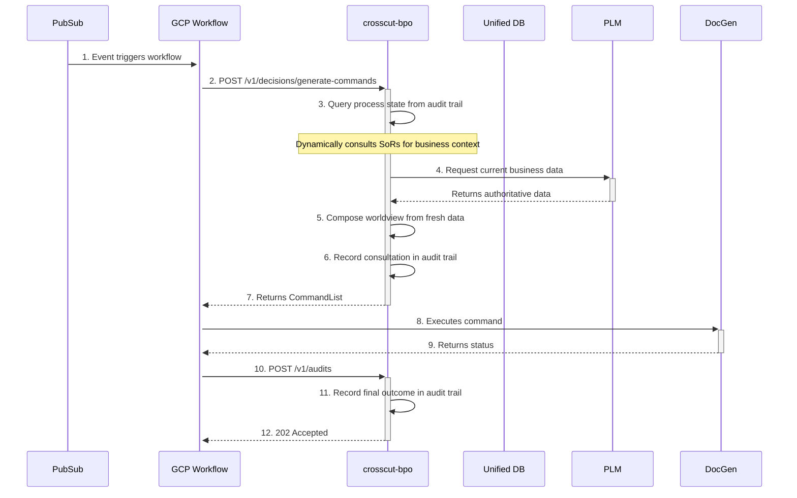

## Technical Specification: CrossCut Business Process Orchestrator (BPO)

**Version:** 1.0  
**Status:** Draft

### 1. Service Name and Purpose

*   **Service Name:** `crosscut-bpo`
*   **Purpose:** To serve as the central "brain" for the CrossCut automation platform. It is a stateless, Go-based microservice responsible for making intelligent, context-aware decisions by dynamically consulting Systems of Record (SoRs) and providing instructions to a stateful orchestration engine (GCP Workflows). It owns and enforces cross-domain business process logic while maintaining clear data ownership boundaries.

### 2. Core Responsibilities

1.  **Listen:** Ingests high-level business intents from external systems, either via direct API calls or by subscribing to events on a Pub/Sub topic.
2.  **Contextualize:** Queries its own process audit trail to understand workflow state, then dynamically consults relevant SoRs via API calls to gather fresh business context needed for decision-making.
3.  **Decide:** Composes a worldview from its own process state and fresh SoR data, then uses internal logic and CUE validation to generate a concrete, actionable plan.
4.  **Instruct:** Returns a structured "Command List" to its caller (GCP Workflows), detailing the precise sequence and parameters of tasks to be executed by worker services.
5.  **Audit:** Records all orchestration decisions, SoR consultations, and workflow outcomes in its process audit trail for complete traceability.

### 3. Architectural Pattern

*   **The Brain (This Service):** A stateless Go service deployed on **GCP Cloud Run**.
*   **The Spinal Cord (GCP Workflows):** A managed orchestration service that calls the `crosscut-bpo` service to get its instructions.
*   **Data Model:** The service maintains its own process audit trail (starting with local storage, evolving to managed database). It dynamically consults external SoRs for business context rather than maintaining cached copies.
*   **SoR Integration:** Uses HTTP clients with session-scoped caching to consult external Systems of Record for authoritative business data during decision-making.

### 4. Key Internal Components (Go Service Structure)

*   `internal/api`: Contains the HTTP handlers for the service's public API.
*   `internal/events`: Contains the handlers for consuming messages from Pub/Sub.
*   `internal/workflows`: Contains the core business logic for each major process.
*   `internal/activities`: Contains small, single-responsibility, testable functions.
*   `internal/services`: A collection of client packages for interacting with all external services (PLM, ERP, etc.).
*   `internal/database`: A data access layer for process audit trail storage, initially using local file storage, evolving to `pgx` for PostgreSQL. This package handles:
    *   Writing to the process audit trail (Anchor Model format).
    *   Reading process state for workflow context.
    *   Managing data persistence and retrieval operations.
*   `internal/cache`: Session-scoped caching layer for SoR consultation data, using Redis or in-memory storage.
*   `internal/sor`: HTTP client adapters for integrating with external Systems of Record, including circuit breakers and retry logic.
*   `internal/cue`: A dedicated package that wraps the `cuelang.org/go` library for process validation.

### 5. Technology Stack

*   **Language:** Go (latest stable version)
*   **API Framework:** `net/http` with `chi` for routing.
*   **Database Library:** File I/O (MVP) → `jackc/pgx` for PostgreSQL (evolution).
*   **HTTP Client:** `net/http` for SoR API integrations.
*   **Caching:** Redis client or in-memory cache for session data.
*   **Circuit Breaker:** `go-kit/circuitbreaker` or similar for SoR availability handling.
*   **Validation:** `cuelang.org/go`
*   **Deployment Target:** GCP Cloud Run (containerized with Docker).

### 6. API Specification (Primary Endpoints)

(No changes to the API specification itself)

*   **Endpoint:** `POST /v1/decisions/generate-commands`
*   **Endpoint:** `POST /v1/audits`

### 7. Transactional Integrity

The `crosscut-bpo` service **must** maintain transactional integrity when recording orchestration decisions. All process state changes, SoR consultation logs, and workflow outcomes must be recorded atomically in the audit trail. For the MVP with local storage, this means ensuring file write atomicity. When evolving to PostgreSQL, this requires ACID-compliant transactions for all audit trail operations.

### 8. Sequence of Interaction

This diagram shows the simplified interaction in the MVP architecture.

