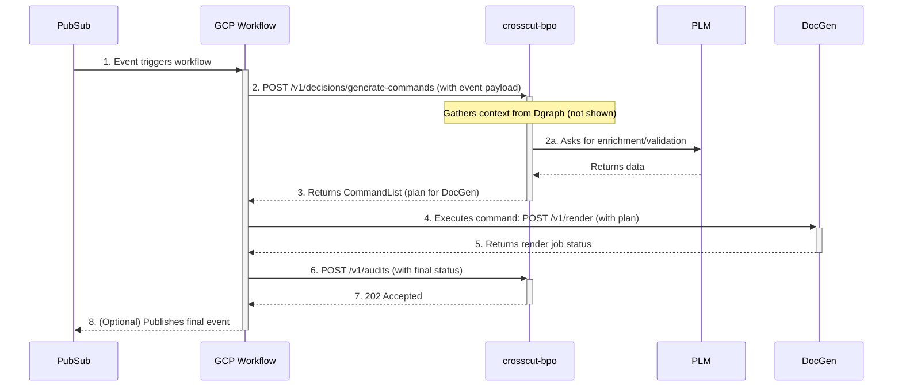

## Technical Specification: CrossCut Business Process Orchestrator (BPO)

**Version:** 1.0  
**Status:** Draft

### 1. Service Name and Purpose

*   **Service Name:** `crosscut-bpo`
*   **Purpose:** To serve as the central "brain" for the CrossCut automation platform. It is a stateless, Go-based microservice responsible for making intelligent, context-aware decisions and providing instructions to a stateful orchestration engine (GCP Workflows). It is the primary owner and enforcer of cross-domain business process logic.

### 2. Core Responsibilities

1.  **Listen:** Ingests high-level business intents from external systems, either via direct API calls or by subscribing to events on a Pub/Sub topic.
2.  **Decide:** Gathers the necessary context from the Dgraph "World Model" read cache to understand the full scope of an intent. It then uses its internal logic and CUE validation to generate a concrete, actionable plan.
3.  **Instruct:** Returns a structured "Command List" to its caller (GCP Workflows), detailing the precise sequence and parameters of tasks to be executed by worker services (`DocGen`, `VizGen`, external APIs, etc.).
4.  **Audit:** Provides an endpoint for workflows to post final status updates, which are recorded in the Postgres Write Model as an immutable, auditable log of the business process.

### 3. Architectural Pattern

The `crosscut-bpo` service is the "Brain" in a "Brain and Spinal Cord" model.

*   **The Brain (This Service):** A stateless Go service deployed on **GCP Cloud Run**. It handles all complex logic, validation, and plan generation. It is optimized for fast, synchronous request/response cycles.
*   **The Spinal Cord (GCP Workflows):** A managed orchestration service. It handles all stateful, long-running processes, including sequencing, retries, parallelism, and waiting. It calls the `crosscut-bpo` service to get its instructions.
*   **Data Model:** The service is a client to two databases but owns neither. It reads from the Dgraph Read Model and writes audit logs to the Postgres Write Model.

### 4. Key Internal Components (Go Service Structure)

The Go service will be organized into a set of clear, modular packages.

*   `internal/api`: Contains the HTTP handlers for the service's public API (e.g., using the `net/http` package or a lightweight router like `chi`). This is the primary entry point for GCP Workflows.
*   `internal/events`: Contains the handlers for consuming messages from a Pub/Sub topic. This is the entry point for asynchronous event triggers. These handlers will typically parse the event and initiate a new GCP Workflow.
*   `internal/workflows`: Contains the core business logic for each major process. This is where the "recipes" live. For example, `new_revision_workflow.go` would contain the function that knows how to handle a `SchematicReleased` event.
*   `internal/activities`: Contains the small, single-responsibility, testable functions that are chained together by a workflow. Examples:
    *   `GeneratePartialPlanWithAI(intent)`
    *   `EnrichPlanFromPLM(plan)`
    *   `EnrichPlanFromERP(plan)`
    *   `ValidatePlanStructure(plan)`
*   `internal/services`: A collection of client packages for interacting with all external services. Each client encapsulates the API logic for talking to another system.
    *   `docgen_client.go`
    *   `vizgen_client.go`
    *   `plm_client.go`
*   `internal/database`: A data access layer for writing audit logs to the Postgres (Anchor Model) database. Uses `pgx`.
*   `internal/graph`: A data access layer for querying the Dgraph "World Model". Uses a GraphQL client library.
*   `internal/cue`: A dedicated package that wraps the `cuelang.org/go` library. It is responsible for loading the process validation schemas and running them against generated plans.

### 5. Technology Stack

*   **Language:** Go (latest stable version)
*   **API Framework:** `net/http` with `chi` for routing.
*   **Database Libraries:** `jackc/pgx` for Postgres, a standard GraphQL client for Dgraph.
*   **Validation:** `cuelang.org/go`
*   **Configuration:** `viper` or standard env vars.
*   **Deployment Target:** GCP Cloud Run (containerized with Docker).

### 6. API Specification (Primary Endpoints)

The service exposes a minimal, task-oriented API designed to be called by GCP Workflows.

*   **Endpoint:** `POST /v1/decisions/generate-commands`
    *   **Purpose:** The primary "ask the brain" endpoint.
    *   **Request Body (`Intent`):**
        ```json
        {
          "trigger_event": "schematic.released",
          "payload": {
            "product_name": "ROUTER-100",
            "revision": "C",
            "source_url": "gcs://..."
          }
        }
        ```
    *   **Success Response (200 OK - `CommandList`):**
        ```json
        {
          "commands": [
            {
              "service_target": "DocGen2",
              "endpoint": "/v1/render",
              "payload": { "...fully resolved doc plan..." }
            },
            {
              "service_target": "WMS",
              "endpoint": "/v1/work-items",
              "payload": { "...new ticket data..." }
            }
          ]
        }
        ```
    *   **Failure Response (400/500):** Standard error JSON.

*   **Endpoint:** `POST /v1/audits`
    *   **Purpose:** To record the final outcome of a business process.
    *   **Request Body (`WorkflowAudit`):**
        ```json
        {
          "workflow_id": "gcp-workflow-instance-123",
          "workflow_name": "NewRevisionWorkflow",
          "status": "SUCCESS",
          "trigger_event": { "...original event..." },
          "artifacts_generated": [
            { "type": "document", "url": "gcs://..." },
            { "type": "ticket", "id": "JIRA-456" }
          ]
        }
        ```
    *   **Success Response (202 Accepted):** No body needed.

### 7. Transactional Integrity in the Write Model

Unlike the `sync-transformer` which handles single, idempotent operations, the `crosscut-bpo` service **must** use ACID-compliant transactions when writing to the Postgres Write Model. 

The reason is that a single business process decision or audit event may require writing multiple, dependent records to the database. For example, completing a workflow might involve:

1.  Creating a final `WorkflowAudit` record.
2.  Updating the status of a parent `ProcessInstance` record.
3.  Writing several `ArtifactGenerated` records.

These operations must be performed within a single transaction. If any step fails, the entire transaction must be rolled back. This ensures that the platform's auditable log remains in a consistent and trustworthy state at all times, preventing partial or corrupt records of a business process.

### 8. Sequence of Interaction

This diagram shows how the stateless BPO service fits into the stateful GCP Workflow.

