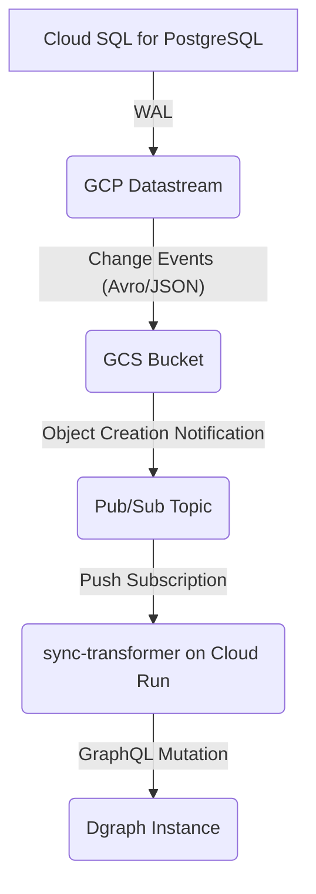

# Technical Specification: The CrossCut Synchronization Service (`sync-transformer`)

**Version:** 1.0
**Status:** Draft

## 1. Overview

The `sync-transformer` service is a critical component of the CrossCut platform's CQRS architecture. Its sole purpose is to keep the **Dgraph Read Model** (the "World Model") synchronized in near-real-time with the **Postgres Write Model** (the transactional, auditable log).

It is a stateless, Go-based microservice, deployed on GCP Cloud Run, that is triggered by events from a Change Data Capture (CDC) pipeline. It consumes change data from Postgres, transforms it from a highly-normalized relational structure into a denormalized graph structure, and writes it to Dgraph.

## 2. Synchronization Pipeline Setup

The synchronization pipeline is a chain of managed GCP services that reliably captures and delivers database changes to the `sync-transformer`.



Here is the step-by-step process for configuring this pipeline:

### Step 1: Configure Cloud SQL (Postgres)

The pipeline relies on Postgres's logical decoding feature, which must be explicitly enabled.

1.  **Enable Logical Decoding:** When creating your Cloud SQL for PostgreSQL instance, set the `cloudsql.logical_decoding` database flag to `on`.
2.  **Create Publication:** Connect to your database and create a publication that covers all the tables in your Anchor Model schema. This tells Postgres which changes to send to the logical decoding stream.

    ```sql
    CREATE PUBLICATION crosscut_cdc FOR ALL TABLES;
    ```

### Step 2: Configure GCP Datastream

Datastream is the service that will capture the Write-Ahead Log (WAL) from Postgres.

1.  **Create a Stream:** In the GCP Console, create a new Datastream stream.
2.  **Source Type:** Select `PostgreSQL`.
3.  **Source Connection Profile:** Configure a connection profile that points to your Cloud SQL instance, providing the necessary credentials and database information.
4.  **Destination Type:** Select `Google Cloud Storage`.
5.  **Destination Connection Profile:** Point the stream to a GCS bucket where the change files will be written. Configure the output format to **JSON**.
6.  **Select Objects to Include:** Configure the stream to capture changes from the `public` schema (or wherever your Anchor Model tables reside), using the `crosscut_cdc` publication you created.
7.  **Start the Stream:** Once configured, start the stream. Datastream will begin writing files containing database changes to your GCS bucket.

### Step 3: Configure GCS and Pub/Sub

This step connects the file creation in GCS to a Pub/Sub message that will trigger the `sync-transformer`.

1.  **Create a Pub/Sub Topic:** Create a new Pub/Sub topic, for example, `gcs-change-events`.
2.  **Create a GCS Notification:** Configure your GCS bucket to send a notification to the `gcs-change-events` topic whenever a new object is created.

    ```bash
    gsutil notification create -t projects/your-project-id/topics/gcs-change-events -f json -e OBJECT_FINALIZE gs://your-gcs-bucket-name
    ```

### Step 4: Deploy the `sync-transformer` Service

The final step is to deploy the Go service that will perform the transformation.

1.  **Build and Containerize:** Build your `sync-transformer` Go application and package it into a Docker container.
2.  **Deploy to Cloud Run:** Deploy the container to Cloud Run.
3.  **Set Trigger:** Configure the Cloud Run service to be triggered by a **Pub/Sub push subscription**. Connect the trigger to the `gcs-change-events` topic.

## 3. Data Transformation Logic

This is the core responsibility of the `sync-transformer`. It must convert data from the 6th Normal Form (6NF) Anchor Model in Postgres to a Labeled Property Graph (LPG) in Dgraph.

### Conceptual Model

*   **Anchor Model (Postgres):** This model is highly normalized. A single business entity (e.g., a "Part") is shredded into multiple tables.
    *   **Knots:** Tables that represent entities that can be described, but not on their own (e.g., `UnitOfMeasure`, `StatusType`).
    *   **Anchors:** Tables that represent the identity of a business entity (e.g., `Part_Anchor` with just an ID and a timestamp).
    *   **Attributes:** Tables that store the properties of an anchor (e.g., `Part_Name_Attribute` with a value, a timestamp, and a foreign key to `Part_Anchor`).
    *   **Ties:** Tables that represent relationships between anchors (e.g., `Part_Assembly_Tie` with foreign keys to two different `Part_Anchor` records).

*   **Labeled Property Graph (Dgraph):** This model is denormalized and optimized for traversal. A single business entity is represented as a single node.
    *   **Nodes:** Represent entities (e.g., a `Part` node).
    *   **Properties:** Key-value pairs on a node (e.g., `name: "Resistor"`, `resistance: "10k"`).
    *   **Edges:** Directed connections between nodes that represent relationships (e.g., an `assembly` edge from one `Part` node to another).

### Transformation Process

The `sync-transformer` receives a JSON payload from Datastream that describes a single row change (INSERT, UPDATE, DELETE) in a Postgres table.

The service's logic should be as follows:

1.  **Identify the Change Type:** Determine if the change is to a Knot, Anchor, Attribute, or Tie table.
2.  **Identify the Anchor:** For any change to an Attribute or a Tie, the first step is to identify the master business entity (the Anchor) that is being affected.
3.  **Re-assemble the Entity:** The service must query Dgraph to get the current state of the node being updated. It then applies the change from the incoming message.
4.  **Construct a GraphQL Mutation:** The service constructs a Dgraph GraphQL mutation to perform an `upsert` operation.
    *   An `upsert` will create the node if it doesn't exist or update it if it does.
    *   This makes the transformation process idempotent and resilient.

### Example Transformation

Let's say Datastream reports an **INSERT** into the `Part_Name_Attribute` table:

*   **Postgres Row:** `(id: 123, part_anchor_id: 456, name: "Resistor-10kOhm", changed_at: ...)`

**`sync-transformer` Logic:**

1.  The service receives this JSON payload.
2.  It identifies the table as `Part_Name_Attribute`.
3.  It extracts the `part_anchor_id` (456) and the new `name` ("Resistor-10kOhm").
4.  It constructs a Dgraph `upsert` mutation. The `xid` (external ID) is crucial for idempotency and should be based on a unique business key if available, or the anchor ID from Postgres.

**Go Pseudo-code:**

```go
package main

// Simplified representation of the incoming JSON from Datastream
type ChangeEvent struct {
    TableName string `json:"_tableName"`
    PartAnchorID int `json:"part_anchor_id"`
    Name string `json:"name"`
    // ... other fields
}

func handleEvent(event ChangeEvent) error {
    // 1. Identify the anchor and the change
    anchorID := event.PartAnchorID
    newName := event.Name

    // 2. Construct the Dgraph mutation (upsert block)
    // We use a query variable '$xid' and a mutation.
    mutation := `
    mutation UpdatePart($xid: String!, $name: String!) {
      addPart(input: {xid: $xid, name: $name}, upsert: true) {
        part {
          id
          xid
        }
      }
    }`

    // 3. Define variables for the mutation
    variables := map[string]interface{}{
        "xid":  fmt.Sprintf("part-%d", anchorID), // Create a unique external ID
        "name": newName,
    }

    // 4. Execute the mutation against the Dgraph GraphQL endpoint
    // (Using a GraphQL client library)
    err := dgraphClient.Execute(mutation, variables)
    return err
}
```

## 4. Error Handling and Resilience

*   **Idempotency:** The use of `upsert` mutations based on a stable external ID (`xid`) is the most critical factor for resilience. If the service processes the same event twice, the outcome will be the same.
*   **Retries:** The Pub/Sub trigger for Cloud Run provides automatic retries with exponential backoff. If the `sync-transformer` fails to process a message (e.g., Dgraph is temporarily unavailable), Pub/Sub will attempt to deliver it again.
*   **Dead-letter Queue:** For messages that fail repeatedly, a dead-letter queue (DLQ) should be configured on the Pub/Sub subscription. This captures poison pill messages for later analysis without halting the entire pipeline.

## 5. A Note on Transactions

The `sync-transformer` service, as designed, does not need to wrap its Dgraph writes in an explicit, multi-operation transaction. This is because each incoming message from the CDC pipeline represents a single, atomic change from the source database.

The use of an **idempotent `upsert` operation** in Dgraph is the key to ensuring data consistency. This atomic operation, combined with the "at-least-once" delivery guarantee of Pub/Sub, ensures that even if an event is processed multiple times, the final state of the data in Dgraph will be correct. Dgraph transactions are reserved for cases where multiple, distinct operations (e.g., several queries and mutations) must all succeed or fail as a single, atomic unit.

